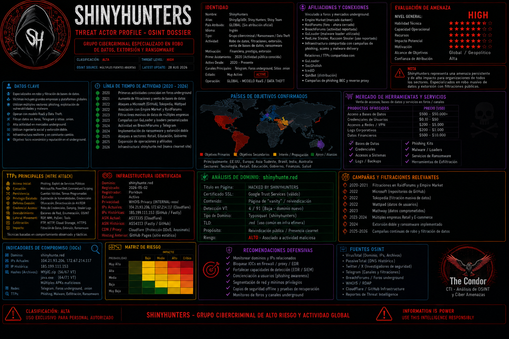
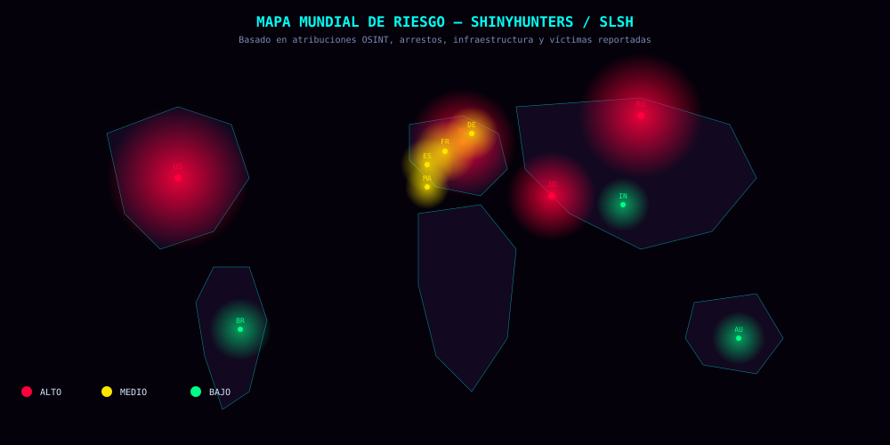

# ShinyHunters / SLSH — Informe CTI y Denuncia

[]()
[](LICENSE)
[]()
[]()
[]()
[]()
[]()
[]()



> **Aviso:** Este repositorio contiene inteligencia de amenazas de fuentes
> públicas con fines **defensivos, educativos y de denuncia**. No contiene
> datos personales de víctimas, credenciales, malware ni herramientas
> ofensivas. Lee el [DISCLAIMER](DISCLAIMER.md) y [ETHICS](ETHICS.md) antes
> de usar cualquier contenido.

---

## Tabla de contenidos

- [¿Qué es esto?](#qué-es-esto)
- [Resumen ejecutivo (BLUF)](#resumen-ejecutivo-bluf)
- [Mapa mundial de riesgo](#mapa-mundial-de-riesgo)
- [Cronología rápida 2026](#cronología-rápida-2026)
- [Actores identificados](#actores-identificados)
- [Infraestructura e IOCs](#infraestructura-e-iocs)
- [Técnicas MITRE ATT&CK](#técnicas-mitre-attck)
- [Contenido del repositorio](#contenido-del-repositorio)
- [Principios éticos](#principios-éticos)
- [Cómo usar este repositorio](#cómo-usar-este-repositorio)
- [Contribuir](#contribuir)
- [Descargo de responsabilidad](#descargo-de-responsabilidad)
- [Licencia](#licencia)
- [Contacto](#contacto)

---

## ¿Qué es esto?

Este repositorio documenta, de forma estructurada y ética, las cuentas,
canales, infraestructura y técnicas asociadas al ecosistema criminal
**ShinyHunters / Scattered LAPSUS$ Hunters (SLSH)**.

El objetivo es:

1. **Denunciar** ante las autoridades (IC3, FBI, X Support, Telegram Abuse)
   las cuentas y canales que suplantan, extorsionan o difunden infraestructura
   criminal.
2. **Documentar** de forma verificable y con fuentes públicas la actividad
   del grupo y sus imitadores.
3. **Proteger** a organizaciones y usuarios, proporcionando IOCs y
   recomendaciones defensivas.
4. **Diferenciar** entre actores reales, afiliados, imitadores (LARPers) y
   opositores, evitando atribuciones falsas o acusaciones infundadas.

---

## Resumen ejecutivo (BLUF)

**ShinyHunters** es un colectivo de ciberdelincuentes de motivación
financiera que ha evolucionado desde un grupo de filtraciones masivas de
datos a un **ecosistema fragmentado de extorsión centrado en identidades
y SaaS**. Google Threat Intelligence Group rastrea su actividad en
múltiples clusters (UNC6040, UNC6240, UNC6661, UNC6671), lo que refleja
la naturaleza cambiante y descentralizada del grupo.

**Datos oficiales del FBI (29 de septiembre de 2026):**

- **Más de 140 organizaciones** comprometidas desde 2025
- **Al menos $70 millones** en pagos de rescate recibidos
- Arresto de **Pepijn van der Stap ("Umbreon")** en Países Bajos el
  **15 de septiembre de 2026**
- El grupo **continúa operando** pese al arresto

**Ataques de alto perfil en 2026:**

- **FBIJobs.gov** — defacement y filtración de PII (21-22 sep)
- **CyrusOne** — rescate de $13M
- **Clop** — hackeo del leak site vía Grav CMS
- **Oracle PeopleSoft** — explotación masiva de CVE-2026-35273
- **Canvas LMS** — 3.65 TB exfiltrados, 9,000+ instituciones educativas

**Nivel de amenaza: ALTO** para organizaciones con ecosistemas SaaS/cloud,
especialmente aquellas que dependen de Salesforce, Okta, PeopleSoft y
plataformas de gestión de identidades.

---

## Mapa mundial de riesgo

Distribución geográfica del riesgo asociado al ecosistema ShinyHunters/SLSH,
basada en atribuciones OSINT, arrestos, infraestructura identificada y
víctimas reportadas.



---

## Mapa mundial de riesgo

```geojson
{
  "type": "FeatureCollection",
  "features": [
    {
      "type": "Feature",
      "properties": {
        "name": "Estados Unidos",
        "level": "ALTO",
        "description": "FBIJobs.gov, CyrusOne, Matthew D. Lane"
      },
      "geometry": {
        "type": "Point",
        "coordinates": [-77.0369, 38.9072]
      }
    },
    {
      "type": "Feature",
      "properties": {
        "name": "Países Bajos",
        "level": "ALTO",
        "description": "Arresto de Van der Stap (Ámsterdam)"
      },
      "geometry": {
        "type": "Point",
        "coordinates": [4.9041, 52.3676]
      }
    },
    {
      "type": "Feature",
      "properties": {
        "name": "Jordania",
        "level": "ALTO",
        "description": "Ray (Ammán), presunto líder actual"
      },
      "geometry": {
        "type": "Point",
        "coordinates": [35.9106, 31.9539]
      }
    },
    {
      "type": "Feature",
      "properties": {
        "name": "Rusia",
        "level": "ALTO",
        "description": "@shinydreffus, KillNet, NoName057(16)"
      },
      "geometry": {
        "type": "Point",
        "coordinates": [37.6173, 55.7558]
      }
    },
    {
      "type": "Feature",
      "properties": {
        "name": "Francia",
        "level": "MEDIO",
        "description": "Arrestos BL2C, conexión Android App"
      },
      "geometry": {
        "type": "Point",
        "coordinates": [2.3522, 48.8566]
      }
    },
    {
      "type": "Feature",
      "properties": {
        "name": "España",
        "level": "MEDIO",
        "description": "Arrestos DDoSia (Sevilla, Huelva, Manacor)"
      },
      "geometry": {
        "type": "Point",
        "coordinates": [-5.9845, 37.3891]
      }
    },
    {
      "type": "Feature",
      "properties": {
        "name": "Alemania",
        "level": "MEDIO",
        "description": "Jurisdicción Tuta, Inside Darknet"
      },
      "geometry": {
        "type": "Point",
        "coordinates": [13.4050, 52.5200]
      }
    },
    {
      "type": "Feature",
      "properties": {
        "name": "Marruecos",
        "level": "MEDIO",
        "description": "Extradición de Sébastien Raoult"
      },
      "geometry": {
        "type": "Point",
        "coordinates": [-6.8498, 34.0209]
      }
    },
    {
      "type": "Feature",
      "properties": {
        "name": "Brasil",
        "level": "BAJO",
        "description": "Víctimas (Google Brasil, Vevo)"
      },
      "geometry": {
        "type": "Point",
        "coordinates": [-47.9292, -15.7801]
      }
    },
    {
      "type": "Feature",
      "properties": {
        "name": "India",
        "level": "BAJO",
        "description": "Víctimas reportadas"
      },
      "geometry": {
        "type": "Point",
        "coordinates": [77.2090, 28.6139]
      }
    },
    {
      "type": "Feature",
      "properties": {
        "name": "Australia",
        "level": "BAJO",
        "description": "Víctimas SaaS reportadas"
      },
      "geometry": {
        "type": "Point",
        "coordinates": [149.1300, -35.2809]
      }
    }
  ]
}
```
**Puntos identificados:**

| País | Coordenadas | Nivel | Justificación |
|---|---|---|---|
| 🇺🇸 EE.UU. | 270, 200 | 🔴 ALTO | FBIJobs.gov, CyrusOne, Matthew D. Lane |
| 🇳🇱 Países Bajos | 575, 150 | 🔴 ALTO | Arresto de Van der Stap (Ámsterdam) |
| 🇯🇴 Jordania | 720, 205 | 🔴 ALTO | "Ray" (Ammán), presunto líder actual |
| 🇷🇺 Rusia | 820, 110 | 🔴 ALTO | @shinydreffus, KillNet, NoName057(16) |
| 🇫🇷 Francia | 565, 165 | 🟡 MEDIO | Arrestos BL2C, conexión Android App |
| 🇪🇸 España | 550, 180 | 🟡 MEDIO | Arrestos DDoSia (Sevilla, Huelva, Manacor) |
| 🇩🇪 Alemania | 590, 145 | 🟡 MEDIO | Jurisdicción Tuta, Inside Darknet |
| 🇲🇦 Marruecos | 555, 205 | 🟡 MEDIO | Extradición de Sébastien Raoult |
| 🇧🇷 Brasil | 310, 440 | 🟢 BAJO | Víctimas (Google Brasil, Vevo) |
| 🇮🇳 India | 850, 290 | 🟢 BAJO | Víctimas reportadas |
| 🇦🇺 Australia | 985, 470 | 🟢 BAJO | Víctimas SaaS reportadas |

### Tabla de riesgo por región

| Región | País | Nivel | Justificación |
|---|---|---|---|
| **Europa Occidental** | 🇳🇱 Países Bajos | 🔴 ALTO | Arresto de Van der Stap (Ámsterdam, 15 sep 2026); sede de investigación |
| **Europa Occidental** | 🇫🇷 Francia | 🟡 MEDIO | Arrestos BL2C junio 2025; conexión Android App de @shinydreffus |
| **Europa Occidental** | 🇩🇪 Alemania | 🟡 MEDIO | Jurisdicción de Tuta; podcast Inside Darknet |
| **Europa Occidental** | 🇪🇸 España | 🟡 MEDIO | Arrestos DDoSia (Sevilla, Huelva, Manacor) |
| **Europa Oriental** | 🇷🇺 Rusia | 🔴 ALTO | @shinydreffus declara Moscú; KillNet; NoName057(16) |
| **Medio Oriente** | 🇯🇴 Jordania | 🔴 ALTO | "Ray" (Ammán) presunto líder actual de SLSH |
| **Norteamérica** | 🇺🇸 EE.UU. | 🔴 ALTO | FBIJobs.gov; CyrusOne; Matthew D. Lane; víctimas SaaS |
| **Norteamérica** | 🇨🇦 Canadá | 🟡 MEDIO | Víctimas SaaS reportadas |
| **Norte de África** | 🇲🇦 Marruecos | 🟡 MEDIO | Extradición de Sébastien Raoult (2023) |
| **América del Sur** | 🇧🇷 Brasil | 🟢 BAJO | Víctimas de filtraciones (Google Brasil, Vevo) |
| **Asia del Sur** | 🇮🇳 India | 🟢 BAJO | Víctimas de filtraciones reportadas |
| **Oceanía** | 🇦🇺 Australia | 🟢 BAJO | Víctimas SaaS reportadas |

**Leyenda:**

| Nivel | Color | Significado |
|---|---|---|
| 🔴 **ALTO** | Rojo | Presencia activa, arrestos, liderazgo o infraestructura |
| 🟡 **MEDIO** | Amarillo | Jurisdicción de servicios, arrestos de afiliados o víctimas |
| 🟢 **BAJO** | Verde | Víctimas reportadas sin presencia activa conocida |
| 🟣 **ATAQUE** | Magenta | Líneas de conexión entre regiones (flujo de ataque) |

---

## Cronología rápida 2026

| Fecha | Evento |
|---|---|
| **Abril 2026** | Grav publica advisory CVE-2026-42608 |
| **29 abril 2026** | Compromiso inicial de Canvas/Instructure |
| **Mayo-junio 2026** | Explotación zero-day CVE-2026-35273 (Oracle PeopleSoft) |
| **7 mayo 2026** | Segundo compromiso de Canvas; defacement |
| **12 mayo 2026** | Deadline de publicación de datos Canvas (3.65 TB) |
| **1 septiembre 2026** | Hackeo del leak site de Clop vía Grav CMS |
| **15 septiembre 2026** | **Arresto de Pepijn van der Stap ("Umbreon")** |
| **21 septiembre 2026** | Presunto compromiso de FBIJobs.gov |
| **22 septiembre 2026** | Defacement de apply.fbijobs.gov |
| **24 septiembre 2026** | FBI confirma investigación |
| **25 septiembre 2026** | Filtración incluye datos médicos/psiquiátricos |
| **25 septiembre 2026** | WAF bypass en Oracle PeopleSoft |
| **28 septiembre 2026** | FBI anuncia arresto de "uno de los líderes" |
| **29 septiembre 2026** | ShinyHunters desmiente que Umbreon sea su líder |

---

## Actores identificados

| Actor | Rol | Estado | Notas |
|---|---|---|---|
| **ShinyHunters (núcleo)** | Grupo original | Activo, fragmentado | Reclama ataques |
| **"Ray" (Jordania)** | Líder actual presunto | Activo | Adolescente, miembro de SLSH |
| **Pepijn van der Stap ("Umbreon")** | Presunto líder histórico | Detenido 15/09/2026 | 24 años, Ámsterdam |
| **Kuroi'SH (Gabriel Kimiaie Asadi-Bildstein)** | Miembro histórico | Cuenta X activa | NASA, Google Brasil, Vevo, Coinrail |
| **DréffusHunters (@shinydreffus)** | Facción que reclama legitimidad | Activo en X | Moscú, enlace .onion, sesión Tox |
| **Lizard Squad (@urharmless)** | Grupo histórico DDoS | Provocador | "You're not Shiny enough" |
| **SLSH / Scattered LAPSUS$ Hunters** | Facción disidente | Activo | Acusado de intentar asesinatos |
| **NoName057(16)** | Grupo prorruso DDoS | Activo | 13 interrogados, 1000+ notificados |
| **KillNet** | Grupo prorruso | Activo | Nikolai Serafimov ("KillMilk") identificado |

---

## Infraestructura e IOCs

### Session IDs (alta prioridad)

```
056a2eaceb35bfba4586d5ad01cde423ee49f229dc70c1735598785ab7f841ba58
0501da0be27ccac7d4cec7ca1a84e9463c7dfa9c4da49552b5f32d69980596d7
05e37988d80adfedf4504c39a1943cad3c082d9ce932c5820ccd98842bbee02f3f
05108377c665c8b923d81fb3413658ea9fa893fa57ad185da91a0ceb5e4f5eeb58
```

### Correos electrónicos

```
sh1nyhunt3rs@tuta.io
shinycorp@tuta.com / shinycorp@tutanota.com
shinygroup@tuta.com / shinygroup@onionmail.com
shinyprocorp@proton.me
shinycorp@onionmail.com
```

### XMPP

```
shinyc0rpsss@xmpp.jp
```

### Onion DLS

```
shnyhntww34phqoa6dcgnvps2yu7dlwzmy5lkvejwjdo6z7bmgshzayd.onion
toolatedhs5dtr2pv6h5kdraneak5gs3sxrecqhoufc5e45edior7mqd.onion
shinypogk4jjniry5qi7247tznop6mxdrdte2k6pdu5cyo43vdzmrwid.onion
```

### Dominios de phishing

```
reliaquest.claims
[empresa].claims (patrón general)
```

---

## Técnicas MITRE ATT&CK

| Táctica | Técnica | ID |
|---|---|---|
| Reconocimiento | Gather Victim Identity Information | T1589 |
| Acceso Inicial | Spearphishing via Service (Voice) | T1566.004 |
| Acceso Inicial | Exploit Public-Facing Application | T1190 |
| Evasíón | Impersonation | T1656 |
| Credenciales | MFA Request Generation | T1621 |
| Credenciales | Steal Web Session Cookie | T1539 |
| Evasíón | Use Alternate Authentication Material | T1550.001 |
| Evasíón | Valid Accounts | T1078 |
| Exfiltración | Exfiltration Over Web Service | T1567 |
| Impacto | Data Encrypted for Impact | T1486 |

---

## Contenido del repositorio

| Archivo | Descripción |
|---|---|
| [docs/informe-principal.md](docs/informe-principal.md) | Informe completo de cuentas y canales |
| [docs/iocs.md](docs/iocs.md) | Indicadores de compromiso (IOCs) |
| [docs/cronologia.md](docs/cronologia.md) | Cronología de eventos 2026 |
| [docs/fuentes.md](docs/fuentes.md) | Fuentes públicas citadas |
| [reports/ic3-submission.md](reports/ic3-submission.md) | Texto preparado para el IC3 |
| [reports/telegram-abuse.md](reports/telegram-abuse.md) | Texto preparado para Telegram Abuse |
| [DISCLAIMER.md](DISCLAIMER.md) | Aviso legal y limitación de responsabilidad |
| [ETHICS.md](ETHICS.md) | Principios éticos del proyecto |
| [SECURITY.md](SECURITY.md) | Política de seguridad y reporte de vulnerabilidades |
| [CONTRIBUTING.md](CONTRIBUTING.md) | Cómo contribuir correctamente |
| [CODE_OF_CONDUCT.md](CODE_OF_CONDUCT.md) | Código de conducta |

---

## Principios éticos

Este proyecto se rige por los siguientes principios:

1. **Solo fuentes públicas.** Todo el contenido proviene de fuentes
   públicas: reportes de threat intelligence, prensa, comunicados oficiales
   y capturas de pantalla de perfiles públicos.
2. **Cero doxxing.** No se publican datos personales de víctimas,
   direcciones, teléfonos, correos privados ni información que permita
   identificar a personas no públicas.
3. **Cero malware.** No se distribuyen binarios, exploits funcionales,
   web shells ni herramientas ofensivas.
4. **Atribución cuidadosa.** Se distingue entre actores confirmados,
   presuntos, afiliados, imitadores y opositores. No se acusa sin evidencia.
5. **Propósito defensivo.** El objetivo es proteger, denunciar y educar,
   no atacar ni facilitar ataques.
6. **Respeto a la ley.** Se colabora con las autoridades y se respetan
   los términos de servicio de las plataformas.

Lee [ETHICS.md](ETHICS.md) para más detalle.

---

## Cómo usar este repositorio

### Si eres defensor / analista SOC

- Consulta [docs/iocs.md](docs/iocs.md) para bloquear infraestructura.
- Revisa [docs/informe-principal.md](docs/informe-principal.md) para
  entender TTPs y actores.
- Aplica las recomendaciones defensivas de la sección 8.

### Si eres investigador / periodista

- Verifica las fuentes citadas en [docs/fuentes.md](docs/fuentes.md).
- Distingue entre hechos verificados y atribuciones presuntas.
- Contacta vía issues para correcciones.

### Si eres autoridad

- Usa [reports/ic3-submission.md](reports/ic3-submission.md) como base
  para tu denuncia.
- Toda la información es TLP:WHITE y puede ser compartida.

### Si eres usuario afectado

- **No pagues** extorsiones.
- Reporta a [IC3.gov](https://www.ic3.gov) y a [tips.fbi.gov](https://tips.fbi.gov).
- Consulta [SECURITY.md](SECURITY.md) para reportar incidentes.

---

## Contribuir

Las contribuciones son bienvenidas **si cumplen los principios éticos**.
Lee [CONTRIBUTING.md](CONTRIBUTING.md) antes de abrir un issue o PR.

**No se aceptan:**
- Datos personales (doxxing)
- Malware o exploits funcionales
- Acusaciones sin evidencia
- Contenido ilegal

---

## Descargo de responsabilidad

Este repositorio se proporciona "tal cual", sin garantía de ningún tipo.
El autor no se hace responsable del uso indebido de la información.
Lee [DISCLAIMER.md](DISCLAIMER.md) para el aviso completo.

---

## Licencia

MIT — ver [LICENSE](LICENSE).

---

## Contacto

- **Issues:** para correcciones y contribuciones
- **Seguridad:** ver [SECURITY.md](SECURITY.md)
- **Autoridades:** este repositorio es TLP:WHITE, usable sin restricciones

---

**TLP:WHITE** — Puede ser compartido sin restricciones.
